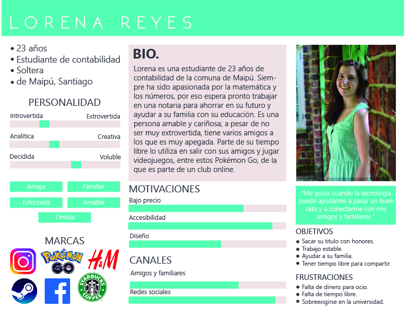
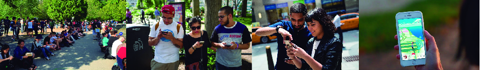
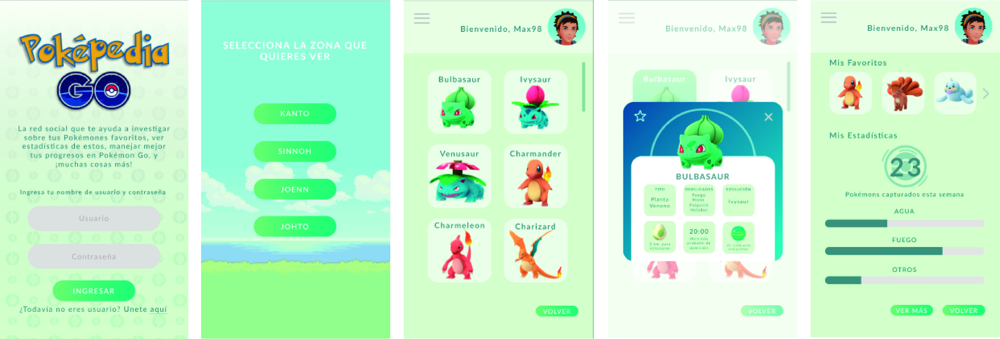

# Iteración Poképedia Go

## 📄 Resumen de la iteración 
En esta etapa se ha decidido iterar en el ámbito de manejo de la aplicación a través de medios móviles como celulares, creando un prototipo responsive de la aplicación; añadiendo así la mayoría de sujerencias solicitadas por los usuarios testeados en el sprint anterior, sumando algunas herramientas de investigación de perfil de usuario y de diseño visual, considerando también las **reglas heurísticas de usabilidad**. 

[Puedes ver nuestro proceso de creación AQUI 👈](https://github.com/ivonneflowers/SCL008-data-lovers)

## 👩👨 Antes de comenzar a diseñar... (Estudio de usuario) 

Se ha decidido aplicar algunas herramientas necesarias para entender mejor el perfil de usuario y los problemas a los que estos individuos se enfrentan con respecto a la aplicación de Pokémon Go que pueden ser abarcados y resueltos por Poképedia. 
Para esto se ha creado un usuario ficticio a través de la herramienta **User Persona** donde esta expondrá sus logros y miedos al usar la app. 

*User persona creado para entender mejor el perfil al que va dirigido la app.*

Al crear a Lorena (este usuario ficticio), se ha creado también un breve **Storytelling** de su experiencia al utilizar la aplicación de Pokémon Go, donde podremos visualizar de mejor manera los problemas concretos a los que se enfrenta en su día a día. 

> "Lorena es una estudiante de 23 años de contabilidad de la comuna de Maipú. Es una persona amable y cariñosa y, aunque un poco tímida, tiene un grupo de amigos a los que ella es muy apegada. Parte de su tiempo libre lo utiliza en salir con ellos y jugar Pokémon Go. Siempre se reúnen en alguna plaza concurrida (Casi siempre es en Parque Ohiggins o Parque Forestal) y aprovechan de sentarse y conversar mientras estan en alguna Poképarada o caminan si necesitan capturar Pokémones más lejanos. 
Le gusta mucho usar esta aplicación ya que se entretiene al mismo tiempo que pasea por la ciudad, pero nunca esta segura de en que horario salir, ya que escucha de sus amigos que hay horarios donde es más fácil capturar a ciertos Pokémones, pero como no sale esa información en la app no puede corroborarla.
>
> Otro problema frecuente con el que se enfrenta es que a veces quiere obtener información de algún Pokémon y no puede obtenerla en el juego ya que no lo ha capturado. Por ende si se lo encuentra o lo quiere intercambiar con algún amigo no tiene la certeza de que esta haciendo lo correcto. 
>
>Cuando la tarde ha acabado y decide irse a su casa, casi siempre toma el metro o una micro que la deja en Plaza de Maipú, a veces toma un colectivo hasta su casa o simplemente camina para aprovechar de eclosionar sus huevos, pero a veces esto no le agrada ya que como no sabe que Pokémon saldrá de estos, suele caminar en vano cuando no le agrada lo que eclosionó del huevo o se repite de lo que ya tiene."

A partir de los inconvenientes surgidos en este *Storytelling*, se han creado nuevas **historias de usuario** en las que se puede trabajar en conjunto con las anteriores para mejorar la experiencia en la app móvil. 

## 📹 📱 Testeo a usuarios a partir de la investigación 

Posterior al estudio realizado previamente se ha diseñado un *prototipo de alta fidelidad nuevo*, realizado con la herramienta **Figma** en formato responsive.  

*Algunas pantallas que pueden ser visualizadas en la aplicación.*

+ [Puedes per vel tablero del nuevo proyecto AQUI 👈](https://www.figma.com/file/XkstWYBUZWyhdhF9yQm9Jyue/POKEPEDIA-RESPONSIVE?node-id=0%3A1) 
+ [Puedes testear el proyecto AQUI 👈](https://www.figma.com/proto/XkstWYBUZWyhdhF9yQm9Jyue/POKEPEDIA-RESPONSIVE?node-id=1%3A2&scaling=scale-down)

Con nuestro prototipo ya definido y las conclusiones obtenidas a partir de este nuevo estudio de usuario se ha logrado testear a dos personas que cumplen con un perfil similar a nuestro usuario ideal creado anteriormente. Son dos mujeres  entre 22 y 25 años, del mismo estrato social y también jugadoras de Pokémon Go. 

+ [Enlace al primer testeo. Daniela, 22 años.]()
+ [Enlace al segundo testeo. Alejandra, 25 años.]()

## 📝 Feedback y conclusiones 

Gracias al testeo realizado a estas dos personas se ha podido extraer información valiosa que nos indica que cosas van por un buen camino y que detalles debemos mejorar para que la experiencia de usuario de esta aplicación sea lo mas agradable posible. Dentro de esto hemos podido destacar: 

### Lo bueno... 

+ Los colores y las fuentes utilizadas fueron agradables y facilitaron la interacción.
+ A los usuarios les agrada que la app sea estéticamente similar al juego Pokémon Go. 
+ La información que aparece en las tarjetas es conscisa y de utilidad. 
+ Agrado bastante el orden del menú y las opciones de búsqueda 
+ Los colores hacen resaltar las imágenes y no son violentos visualmente. 
+ La información tiene un fácil acceso, es decir, no necesita ahondar tanto en la app para obtenerla. 

### En lo que debemos trabajar...

+ Se considera cambiar la ubicación del acceso al perfil de usuario de la barra de menú al icono del avatar en la barra de navegación superior, ya que así concuerda más con otras aplicaciones. 
+ Especificar más la información en el perfil, quizás colocar datos extraídos del juego como: cantidad de candies obtenidos o clasificación de pokémones atrapados según su tipo. 
+ Mejorar la interfaz al acceder al menú de hamburguesa. 
+ Diferenciar a través de espesor de línea los títulos de la info. 
+ Cambiar barra de desplazamiento por flechas que indiquen la distribución de Pokémons en pantalla. 

Como última observación, nos hemos dado cuenta que quizás Figma no sea la mejor herramienta de creación de prototipos de alta fidelidad, ya que al hacer los testeos responsivos, la app se "pegaba" en móviles más antiguos. Considerar explorar otras herramientas. 

*Iteración del proyecto Data Lovers realizado por [**Macarena Terán**](https://github.com/ivonneflowers). Proyecto creado por [**Alexandra Fernández**](https://github.com/aleisabl) y **Macarena Terán** para [**Laboratoria Chile**](https://github.com/Laboratoria).* 
