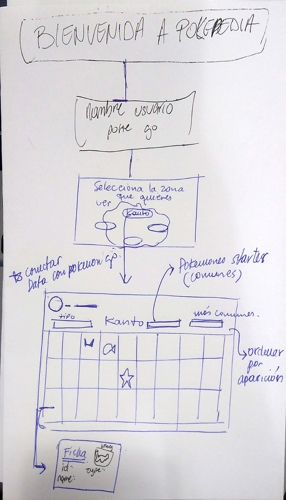
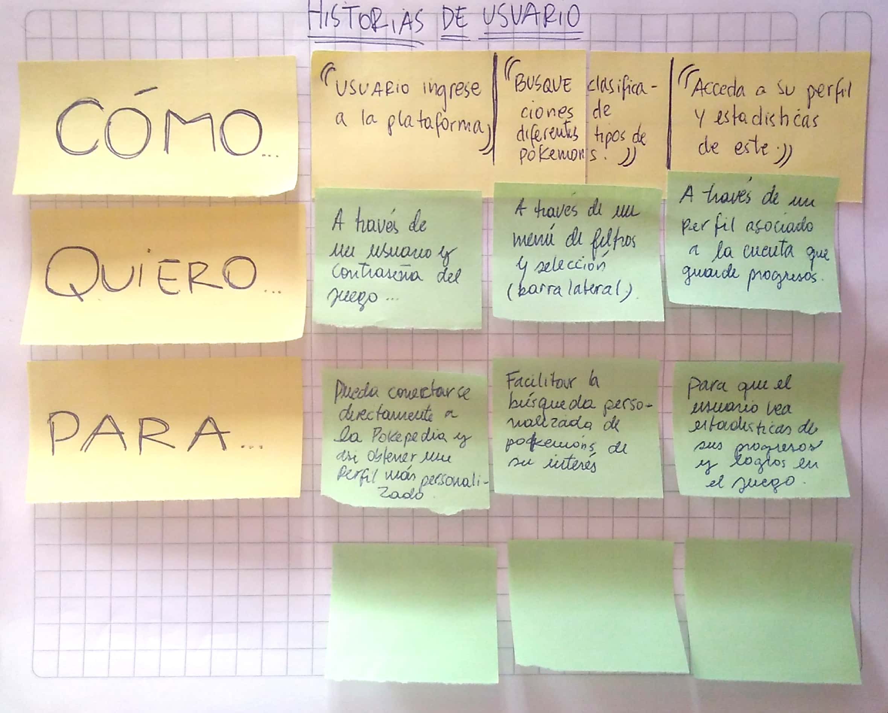
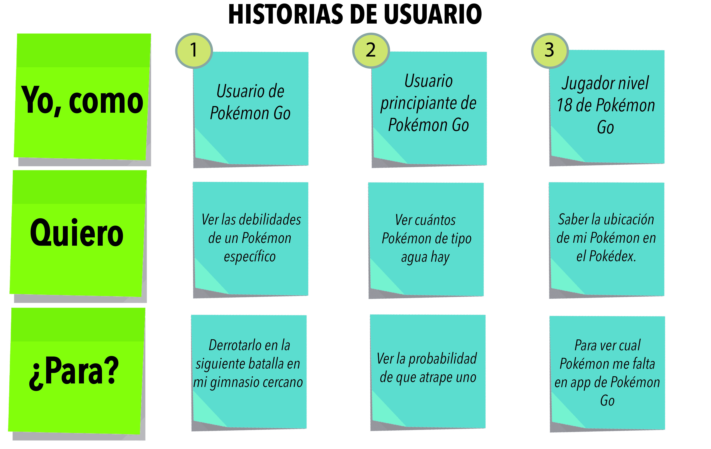
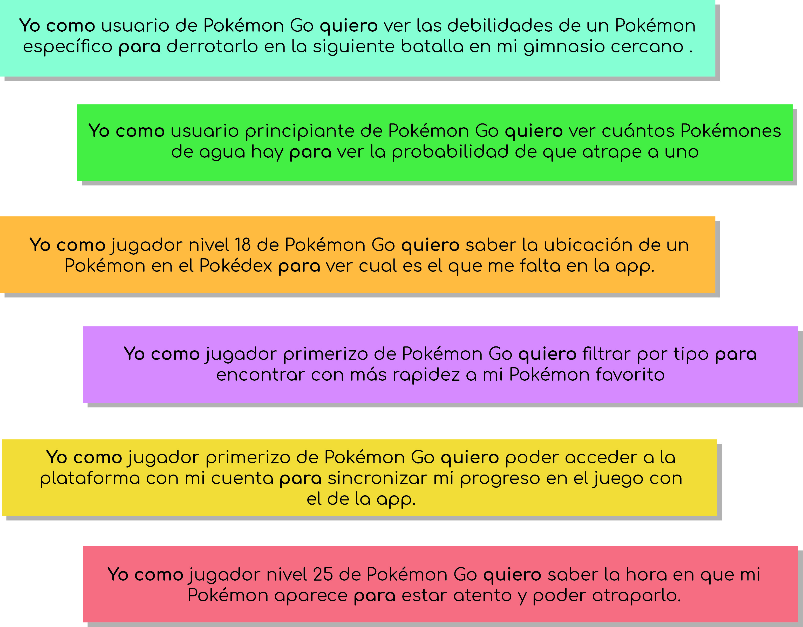
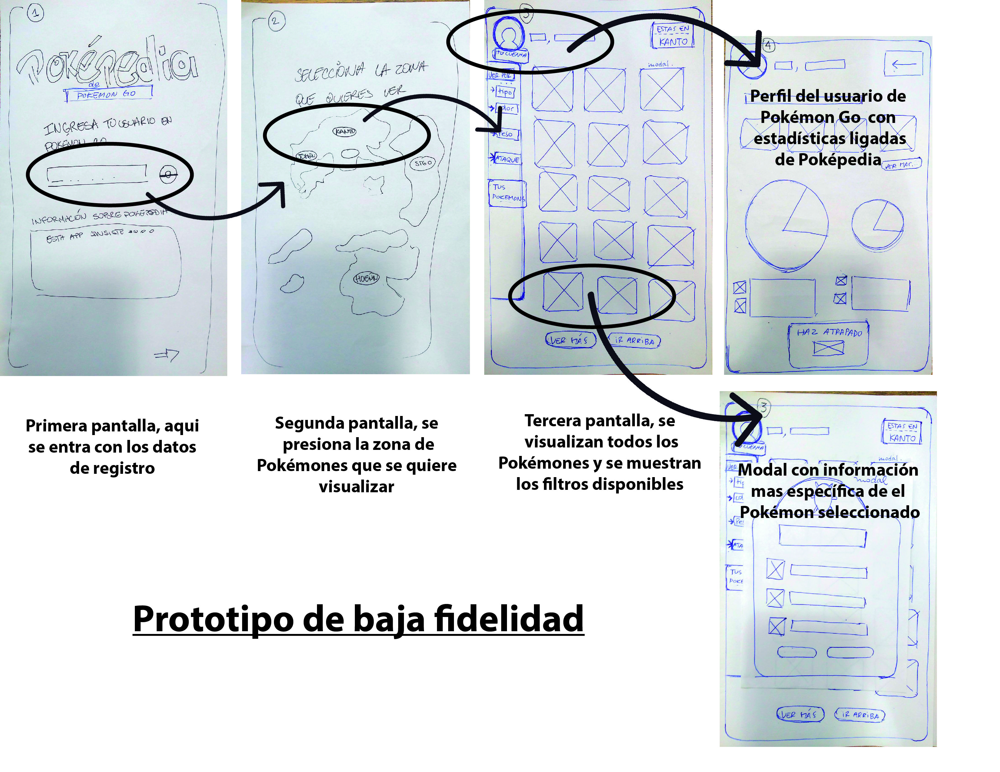
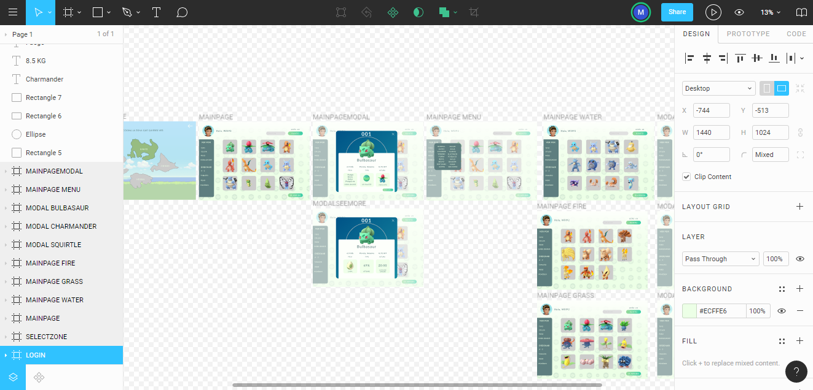

# Poképedia

## 👀 ¿De qué se trata? 
**Poképedia** es una aplicación web responsiva que esta diseñada para jugadores de nivel medio de [Pokémon Go!](https://www.pokemongo.com/es-es/) . Esta te permite acceder a información detallada sobre tus Pokémones favoritos y buscar intuitivamente características y estadísticas que quieras conocer. 

* [¿Cómo funciona?](#como-funciona)
* [Objetivos de la aplicación](#objetivos-de-la-aplicacion)
* [Planificación del proyecto](#planificacion-del-proyecto)
* [Estudio de usuario](#estudio-de-usuario)
* [Diseño y testeos a usuarios](#diseño-y-testeo-a-usuarios)
* [Implementación al código](#implementación-al-codigo)
* [Resumen](#resumen)
* [Reflexión y futuras iteraciones](#reflexion-y-futuras-iteraciones)

***

## 💡 ¿Cómo funciona? 
Poképedia es una aplicación web que te permite enlazar tu cuenta de Pokémon Go a la plataforma y asi crear un *perfil de usuario*, en este puedes guardar y ver estadísticas de tus progresos en el juego y también de tus pokémones favoritos revisados dentro de la misma app. 
***
## 📋 Objetivos de la aplicación 
* Entrar a la plataforma utilizando y enlazando tu cuenta de Pokémon Go. 
* Dividir los Pokémones según el sector donde ellos se hayan encontrado y permitir al usuario escojerlos de esta forma. 
* Visualizar Pokémones a través de tarjetas con información destacada.

* Clasificar y filtrar Pokémones según los deseos del usuario para acceder mas facilmente a alguna característica específica. 

* Proporcionar un perfil de usuario que permita guardar progresos y estadísticas de lo que el usuario desee. 

***
## ✏️ Planificación del proyecto
 
 Después de leer detenidamente los [requisitos del proyecto](https://github.com/Laboratoria/SCL008-data-lovers), se procedió a realizar una *lista de tareas* según los procedimientos mas comunes para llevar a cabo esta misión. Posteriormente se iría puliendo y desglosando de acuerdo a las *historias de usuario* , *prototipos de baja y alta fidelidad* y *encuestas* que en conjunto nos dieron una idea más específica sobre lo que debíamos hacer y como comenzar a trabajar.  
 También se realizó un breve *diagrama de flujo* donde se expusieron las principales características que querían mostrarse en la aplicación. A pesar de que era un bosquejo bastante arcaico, nos dio la idea que queríamos realizar después en el *prototipo de baja fidelidad*

 

 link de enlace para tablero de planificación (Trello) [aquí](https://trello.com/b/YGdTtMSS/proyecto-2-data-lovers) 👈

***
## 👦👧 Estudio de usuario

### Historias de usuario
Para poder crearse una idea mucho más clara de los objetivos que se necesitaban cumplir en la aplicación, se decidió crear algunas *Historias de usuario*, donde les dabamos a estos usuarios ideales algunas necesidades a cumplir para tener una mejor idea de como realizarlas. 

*Aquí se muestra el primer acercamiento de las historias de usuario a realizar.*

*Aquí hay una primera iteración de estas.*

*Última iteración de historias de usuario, como se puede observar, se ha cambiado el formato y se han desglosado mas especificamente las acciones y necesidades.* 

### Encuestas
***
En conjunto con esto se realizó una encuesta a través de redes sociales donde preguntamos en diversos grupos de fanáticos y seguidores del juego cuáles eran los aspectos más importantes a considerar para crear nuestra app. Los resultados se pueden ver [aquí](https://docs.google.com/forms/d/1t-zrfMu7Si33JbUeq5hnvYJxdjWXho0tyHd7MDa6Zmo/edit#responses). 👈

En resumen, pudimos rescatar variada información que en principio no esperabamos que fuese de tal manera, por ejemplo: 

* La mayoría de los encuestados eran **mujeres**, mayores de **20-25 años**

* La totalidad de las personas que pertenecen a estos grupos, por ende están mas afines a consumir aplicaciones web cuando estan por sobre el **nivel 20 del juego**. (Lo que nos da un margen sobre la información que se quiere mostrar).

* La mayoría prefirió que el sitio fuese mas gráfico.
* La mayoría prefirió que el sitio estuviese ligado a su cuenta de Pokémon Go. 
* La mayoría no es seguidor de otros juegos relacionados con el mundo Pokémon. 

## 📹 Diseño y testeos a usuarios

### Diseño de la Interfaz de Usuario
#### Prototipo de baja fidelidad
Cuando tuvimos un margen de lo que deseaba el usuario mayormente; procedimos a realizar algunos prototipos básicos para ver reacciones en personas y su posterior feedback. En esta etapa no se hace referencia a ningún tema estético, tampoco a colores y formas; solo a la ubicación de contenido y como este interactúa. 

 
Lamentablemente no se pudieron grabar los testeos realizados en esta etapa a diferentes personas, pero se recibió feedback importante como : 
 
 * Asegurarse de que la interfaz de usuario sea coherente con el nivel de experticia del mismo. 

 * Eliminar algunos botones innecesarios como el "ver más", ya que se redunda en acciones junto con el de "subir".

 * Se encontró que en general la organización de las cosas se encuentra bien, se quiere asimilar con el de la aplicación, pero hay que tener cuidado de conservar la identidad propia. 

#### Prototipo de alta fidelidad

*Trabajando en el prototipo de alta fidelidad a través de Figma*

Posterior al primer feedback, se procedió a integrar colores, imágenes y detalles en cuanto a diseño visual más detallados a través de la plataforma Figma de diseño de páginas web. También se logró realizar un Moodboard de usuario para poder tener una referencia de la gama de colores a utilizar en nuestra aplicación.   

*Predominancia de colores verdosos y azulinos, acompañados por rosados y lilas*.

* Link de tablero de nuestro prototipo de alta fidelidad [aquí](https://www.figma.com/file/TkgVtthZSetS4I4I2aDJeNzS/Poképedia?node-id=2%3A0) 👈

* Link de presentación de prototipo [aquí](https://www.figma.com/proto/TkgVtthZSetS4I4I2aDJeNzS/Poképedia?node-id=2%3A0&scaling=contain) 👈

Una vez definido el diseño general de la página, se hicieron nuevamente test de usuarios para ver en que se podía mejorar, estos pudieron ser grabados. Aquí estan los links de algunos de estos test. 

* [Primer testeo a usuario experimentado](https://www.useloom.com/share/b5ff78394657465b9496e6f57555b166)

* [Segundo testeo a usuario de nivel medio. Primera parte](https://www.useloom.com/share/fd965f3a3f5e43359808e94d7c01b0c5)
* [Segundo testeo a usuario de nivel medio. Segunda parte](https://www.useloom.com/share/22ded8e0170340ba98f4a35cf6683a9b)

* Aqui va otro link de testeo a usuario 

El feedback que pudimos rescatar de estos testeos fue principalmente:

* Dar la posibilidad de ingresar a la página sin ligar directamente la cuenta a la app de Pokémon Go, en algunos casos esto segregaría mucho al universo de posibles usuarios o quizas sólo se interesen por ver información en vez de recibir estadísticas de su perfil.

* Les agradó el tema de que estuviesen organizados como una ficha los Pokémones, pero les interesa que en estas fichas no solo este la imagen, sino también el nombre de este. 

-  Al momento de presionar la ficha se abre un modal con información más específica del Pokémon seleccionado; dentro del feedback que recibimos solo en el modal se ha concluído que:

   - No consideran que el tamaño o el peso sea información que les interese, ya que suelen ser relativos en cuanto a cada especie, además esto no influye en su fortaleza.
   - Consideran que dentro de lo que más les interesa saber (y por ende debería ser información más a la vista) son las debilidades, la probabilidad de atrape y la hora. También les gustaría saber la cantidad de kilómetros que deben caminar para eclosionar un huevo de cierto tipo, ya que esta info no aparece en el juego. 

* Consideran que la barra de búsqueda es necesaria, pero solo en casos específicos. Por el momento se ha decidido suprimirla y considerarla en futuras iteraciones.
* La barra de menú debería ser un poco más grande para que resalte dentro de la información expuesta en la pantalla.

***

Junto con esto, hemos logrado hacer algunos testeos a través de celulares y tablets, para evaluar cuan efectivo es el *responsive* que estamos creando para la app. dentro de los feedbacks entregados pudimos rescatar: 

* Los modales en celulares se ven un poco grandes, es necesario modificar el tamaño. 

* 
*

***

## Implementación al código (Resultados)
### [link a deploy del proyecto](lalal)
### Pruebas unitarias 
#### Mostrar data
#### Filtrar data
#### Ordenar 
#### Estadísticas 
***

## Resumen
### Reflexión y futuras iteraciones

